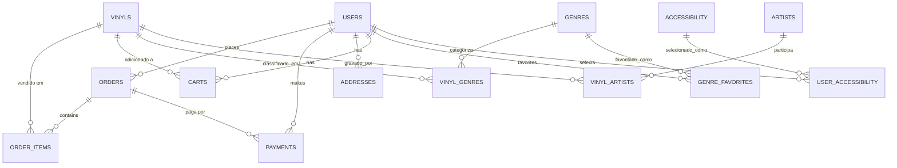

# vinyl-banco

Este projeto contém o script completo para criação do **banco de dados PostgreSQL** que dá suporte à Vinyl Figures — uma loja virtual de discos de vinil. O schema cobre cadastro de usuários e endereços, catálogo de vinis (com artistas e gêneros), carrinho, pedidos, pagamentos e preferências de acessibilidade dos usuários.

## Sumário

- [vinyl-banco](#vinyl-banco)
  - [Sumário](#sumário)
  - [Estrutura do banco](#estrutura-do-banco)
  - [Diagrama de entidades](#diagrama-de-entidades)
  - [Tipos enumerados](#tipos-enumerados)
  - [Regras e validações no schema](#regras-e-validações-no-schema)
  - [Pré-requisitos](#pré-requisitos)
  - [Como rodar o script](#como-rodar-o-script)
  - [Declaração de uso de IA](#declaração-de-uso-de-ia)
  - [Licença](#licença)

## Estrutura do banco

O banco é composto pelas seguintes tabelas:

| Tabela | Colunas principais | Observações |
|---|---|---|
| `users` | `id`, `name`, `document` (11 dígitos, único), `cellphone` (único), `email` (único), `password` | `password` armazena o hash, não a senha em texto puro |
| `vinyls` | `id`, `title`, `price` (> 0), `description`, `released_at` (ano, `CHAR(4)`), `image_url` | |
| `orders` | `id`, `id_user` → `users`, `total_price` (>= 0), `created_at` | Representa o pedido feito no checkout |
| `order_items` | `id`, `id_order` → `orders` (`ON DELETE CASCADE`), `id_vinyl` → `vinyls`, `price_at_purchase` (> 0) | Guarda o preço no momento da compra, preservando o histórico mesmo se o preço do vinil mudar depois |
| `payments` | `id`, `value` (> 0), `payment_method` (enum), `status` (enum), `created_at`, `id_user` → `users`, `id_order` → `orders` (opcional) | Pagamento pode existir sem estar vinculado a um pedido |
| `artists` | `id`, `name`, `description` | |
| `genres` | `id`, `name` (único) | |
| `accessibility` | `id`, `name`, `description` | Recursos de acessibilidade disponíveis |
| `vinyl_genres` | `id`, `id_vinyl` → `vinyls` (`CASCADE`), `id_genre` → `genres` (`CASCADE`) | N:N entre vinis e gêneros; par `(id_vinyl, id_genre)` único |
| `vinyl_artists` | `id`, `id_vinyl` → `vinyls` (`CASCADE`), `id_artist` → `artists` (`CASCADE`) | N:N entre vinis e artistas; par `(id_vinyl, id_artist)` único |
| `genre_favorites` | `id`, `id_user` → `users` (`CASCADE`), `id_genre` → `genres` (`CASCADE`) | Gêneros favoritados por usuário; par único |
| `user_accessibility` | `id`, `id_user` → `users` (`CASCADE`), `id_accessibility` → `accessibility` (`CASCADE`) | Recursos de acessibilidade selecionados por usuário; par único |
| `carts` | `id`, `id_user` → `users` (`CASCADE`), `id_vinyl` → `vinyls` (`CASCADE`) | Carrinho persistido no banco, por usuário; par `(id_user, id_vinyl)` único |
| `addresses` | `id`, `number`, `complement`, `zip_code` (CEP, 8 dígitos), `id_user` → `users` (`CASCADE`) | |

## Diagrama de entidades



## Tipos enumerados

| Tipo | Valores |
|---|---|
| `payment_method` | `DEBITO`, `CREDITO`, `PIX`, `BOLETO`, `TED` |
| `status` (pagamento) | `PENDENTE`, `APROVADO`, `CANCELADO` |

## Regras e validações no schema

O script aplica várias validações diretamente via `CHECK`, além das foreign keys:

- `users.document`: exatamente 11 dígitos numéricos (formato de CPF).
- `users.name`, `cellphone`, `email`, `password`: não podem ser vazios.
- `vinyls.price`: precisa ser maior que zero.
- `vinyls.released_at`: exatamente 4 dígitos numéricos (ano).
- `vinyls.title`, `image_url`: não podem ser vazios.
- `orders.total_price`: não pode ser negativo.
- `order_items.price_at_purchase`: precisa ser maior que zero.
- `payments.value`: precisa ser maior que zero.
- `addresses.zip_code`: exatamente 8 dígitos numéricos (formato de CEP).
- `genres.name`: único no banco todo (não só por vínculo).

Exclusões em cascata (`ON DELETE CASCADE`) estão em `order_items`, `vinyl_genres`, `vinyl_artists`, `genre_favorites`, `user_accessibility`, `carts` e `addresses` — ou seja, remover um usuário ou um vinil também remove os registros dependentes dessas tabelas. `orders` e `payments` **não** têm cascade a partir de `users`, então um usuário com pedidos ou pagamentos associados não pode ser removido sem tratar essas referências antes.

## Pré-requisitos

- PostgreSQL 14+
- `psql` (cliente de linha de comando) ou uma IDE com suporte a SQL

## Como rodar o script

```bash
psql -h localhost -U <usuario> -d <banco> -f script.sql
```

O script começa com `DROP SCHEMA IF EXISTS PUBLIC CASCADE`, então também serve para resetar o banco do zero sempre que for executado.

## Declaração de uso de IA

Este README foi redigido com apoio do **Claude (Anthropic)**, a partir da leitura do `script.sql` fornecido pelo grupo (definição de tipos enumerados, tabelas, colunas, constraints `CHECK` e foreign keys), para garantir que a estrutura, o diagrama de entidades e as regras de validação documentados aqui refletem o que está realmente implementado no schema.

| Parte do documento | Ferramenta de IA | O que foi gerado/apoiado | Nível de revisão feito pelo grupo |
|---|---|---|---|
| Tabela de estrutura do banco | Claude (Anthropic) | Levantamento de todas as tabelas, colunas principais e relacionamentos a partir do `script.sql` | Davi Liu |
| Seção de regras e validações | Claude (Anthropic) | Extração das constraints `CHECK` e das políticas de `ON DELETE CASCADE` do script | Lucas de Carvalho |
| README.md | Claude (Anthropic) | Redação do documento a partir da leitura do `script.sql` | Davi Aliaga |

## Licença

Distribuído sob a licença MIT — veja [`LICENSE`](LICENSE).